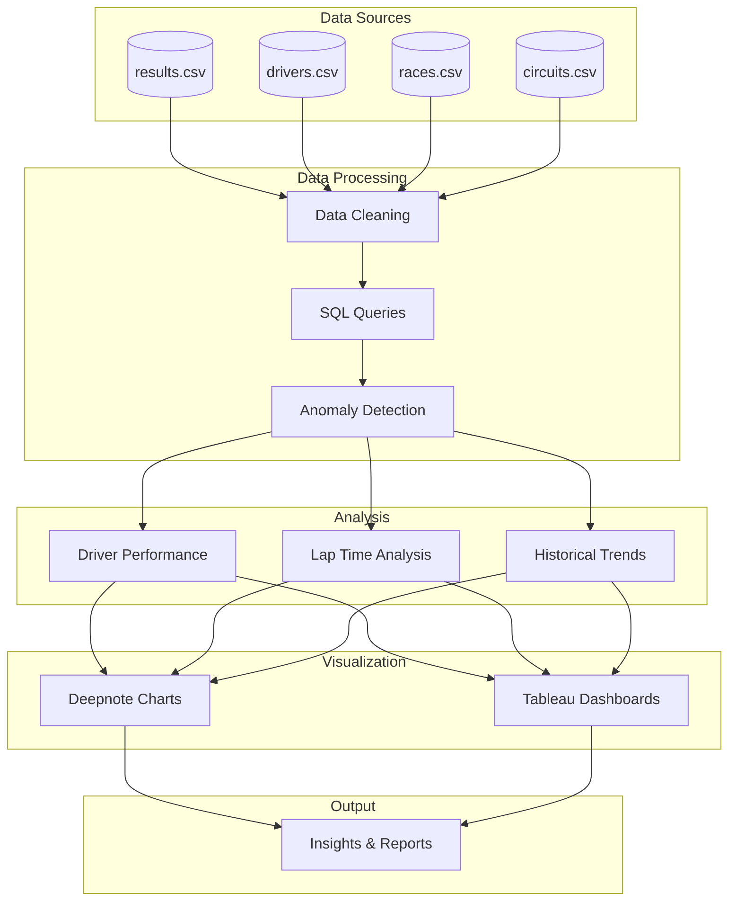
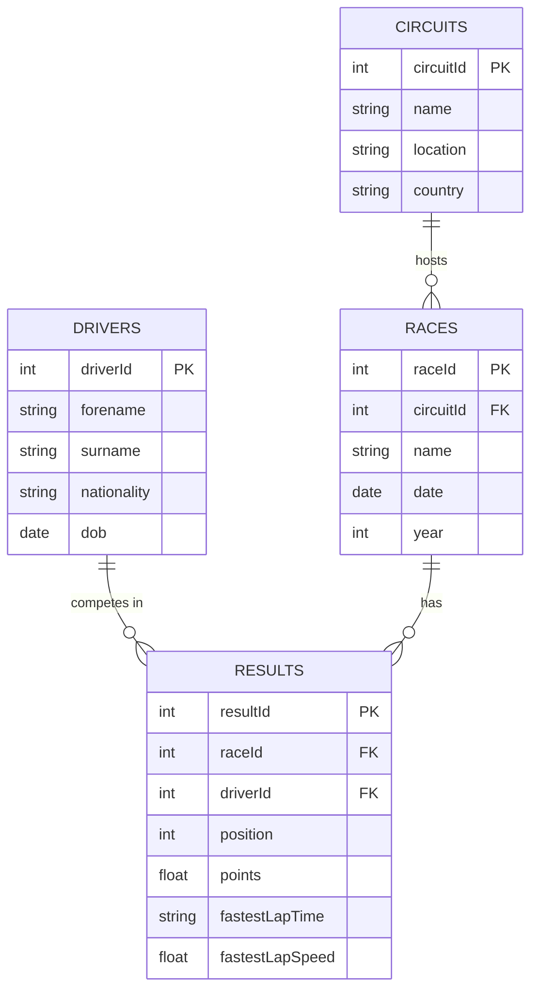
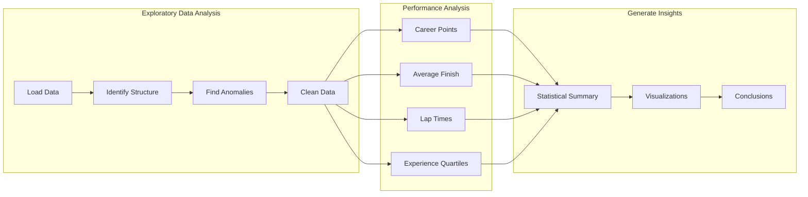
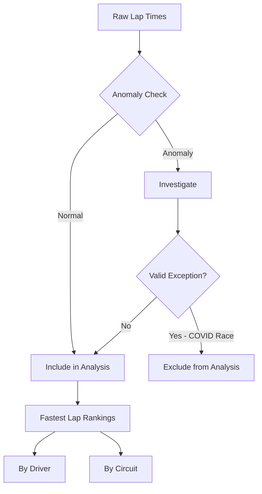
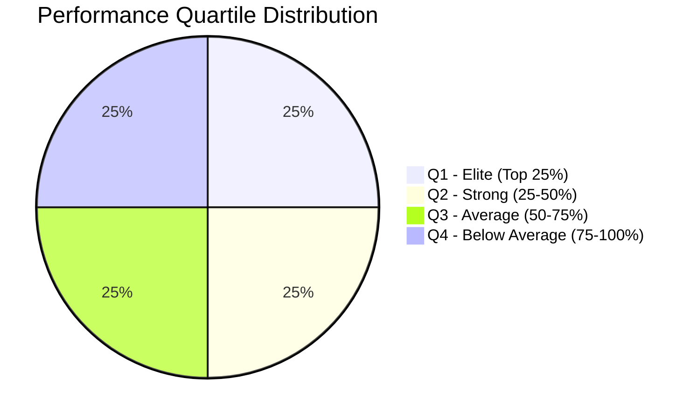
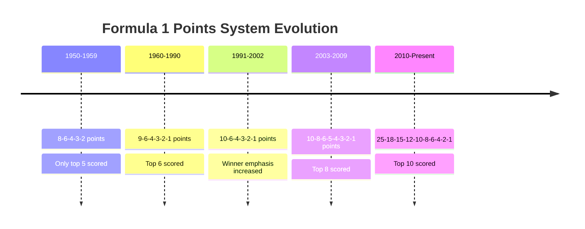
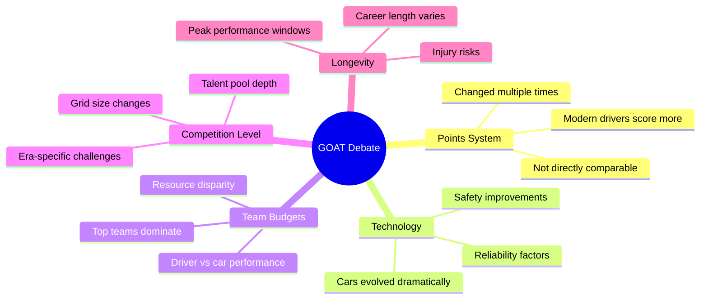

# F1 Data Analysis Project

The Formula 1 Data Analysis project is a comprehensive exploration of the world of Formula 1 racing through the lens of data analytics. This project combines the power of SQL for data manipulation and Tableau for data visualisation to provide insights into the thrilling world of Formula 1 racing from 1953-2020.

## Key Components:

Data Collection and Preparation: The project begins by gathering extensive Formula 1 data, including race results, driver statistics, team information, and circuit details. This raw data is then cleaned and organised for analysis.

Database Design: A relational database is created using SQL to efficiently store and manage the Formula 1 data. This step includes defining tables, relationships, and constraints to ensure data integrity.

SQL Data Queries: SQL queries are crafted to extract meaningful insights from the database. This may involve calculating driver and team performance metrics, historical trend analysis, and identifying key patterns in the data.

Tableau Visualisation: The SQL-derived insights are visualised using Tableau, a powerful data visualisation tool, and Deepnote. Interactive dashboards and reports are designed to provide users with a user-friendly interface to explore the data.

Performance Analysis: Using SQL and Tableau, the project delves into various aspects of Formula 1 racing, such as driver performance across seasons, race track statistics, and the impact of rule changes.

Reporting and Presentation: The project concludes by creating comprehensive reports and presentations that summarise the findings, making it accessible to a wider audience.

## Benefits:

Gain a deeper understanding of Formula 1 racing from a data-driven perspective.

Enhance the overall Formula 1 fan experience by making complex data accessible and engaging.

This project offers a unique opportunity to combine the technical skills of SQL with the data visualisation capabilities of Tableau to unlock insights about one of the dynamic sports in the world.

## Links:

Link to full Deepnote Project Notebook: # 🏎️ Formula 1 Data Analysis (1953–2020)

A comprehensive exploration of Formula 1 racing through data analytics, combining SQL for data manipulation with Deepnote and Tableau for visualization. This project analyzes decades of F1 history to uncover performance insights and explore the debate: *Who is the greatest F1 driver of all time?*


---

## 📊 Key Findings at a Glance

| Metric | Result | Details |
|--------|--------|---------|
| 🏁 **Most Races** | Fernando Alonso | 358 career races |
| 🏆 **Most Career Points** | Lewis Hamilton | 4,396 points |
| ⚡ **Fastest Ever Lap** | Carlos Sainz | Red Bull Ring, 2020-07-12 (1:05.6) |
| 🥇 **Highest Avg Finish** | Alberto Ascari | 2.18 average position (min 20 races) |
| 📉 **Lowest Avg Finish** | Nikita Mazepin | 17.8 average position (min 20 races) |

---

## 🔍 Project Overview

This project performs in-depth exploratory data analysis on Formula 1 data spanning nearly seven decades (1953–2020). By leveraging SQL for data manipulation and combining it with powerful visualization tools, we uncover hidden patterns, analyze driver performance metrics, and provide data-driven insights into one of the world's most dynamic sports.

### 🎯 Objectives

- Identify candidates for the greatest Formula 1 driver of all time
- Analyze driver performance across multiple metrics and eras
- Detect anomalies and outliers in race data
- Visualize trends and patterns in F1 racing history
- Provide context for cross-era comparisons

---

## 🏗️ Project Architecture



---

## 🗄️ Database Schema



---

## 📈 Analysis Workflow



---

## 🔬 Detailed Analysis Breakdown

### 1️⃣ Exploratory Data Analysis (EDA)

The analysis begins with understanding the data structure, identifying errors, and uncovering patterns:

- **Most Experienced Driver**: Fernando Alonso leads with 358 career races, followed by Kimi Räikkönen (352)
- **Anomaly Detection**: Identified RaceID 1046 (Bahrain 2020) as an outlier due to a reformatted COVID-era race with unusually fast lap times under 60 seconds
- **Data Cleaning**: Excluded anomalous data points to prevent skewing results

### 2️⃣ Lap Time Analysis



**Key Findings:**
- **Fastest Ever Lap**: Carlos Sainz at Red Bull Ring (2020-07-12) — 1:05.6
- **Slowest Circuit**: Circuit de Spa-Francorchamps (Belgium) — longer track length
- **Fastest Circuit**: Red Bull Ring (Austria) — short, high-speed layout

### 3️⃣ Driver Performance Metrics



**Experience Level Categories:**
| Level | Race Count | Characteristics |
|-------|------------|-----------------|
| Rookie | 1–50 races | Learning phase, variable results |
| Developing | 51–100 races | Establishing consistency |
| Experienced | 101–150 races | Peak performance years |
| Veteran | 151+ races | Sustained excellence |

### 4️⃣ Points System Evolution

The F1 points system has changed significantly over the decades, making direct comparisons challenging:



---

## 🛠️ Technologies Used

| Technology | Purpose | Details |
|------------|---------|---------|
| **SQL** | Data Querying | Complex joins, window functions, CTEs, aggregations |
| **Deepnote** | Interactive Analysis | Notebook environment with built-in charting |
| **Tableau** | Dashboards | Interactive visualizations and reporting |
| **Python** | Data Processing | Automation and additional analysis |

---

## 📁 Data Sources

The project utilizes multiple interconnected datasets:

```
📦 data/
├── 📄 results.csv      # Race results, positions, points, lap times
├── 📄 drivers.csv      # Driver names, nationalities, DOB
├── 📄 races.csv        # Race metadata, dates, circuit references
└── 📄 circuits.csv     # Circuit names, locations, countries
```

**Data Coverage:**
- **Time Span**: 1953–2020 (67 years)
- **Total Races**: 1,000+ Grand Prix events
- **Drivers**: 800+ unique drivers
- **Circuits**: 70+ unique circuits worldwide

---

## 📊 Visualizations Included

| Visualization | Type | Insights |
|---------------|------|----------|
| Most Races by Driver | Bar Chart | Top 25 most experienced drivers |
| Alonso's Fastest Laps | Scatter Plot | Circuit-by-circuit performance |
| Fastest Laps by Track | Line Chart | Track characteristics comparison |
| Experience vs Points | Bar Chart | Correlation between races and points |
| Avg Finish Position | Bar Chart | Performance consistency metrics |
| Performance Quartiles | Grouped Analysis | Driver categorization by era |

---

## 🏁 The Greatest Driver Debate

### Why It's Complicated



### The Case for Different Eras

| Era | Top Drivers | Context |
|-----|-------------|---------|
| **1950s** | Fangio, Ascari | Dangerous conditions, mechanical unreliability |
| **1960s-70s** | Clark, Stewart, Lauda | High fatality rates, driver courage paramount |
| **1980s-90s** | Prost, Senna, Schumacher | Technology revolution, fierce rivalries |
| **2000s-2010s** | Schumacher, Alonso, Vettel | Aerodynamic era, team dominance |
| **2010s-2020s** | Hamilton, Verstappen | Hybrid era, data-driven performance |

---

## 🚀 Getting Started

### Prerequisites

- SQL-compatible database or query environment
- Deepnote account (optional, for notebook access)
- Tableau Desktop/Public (optional, for dashboard)

### Installation

1. **Clone the repository:**
   ```bash
   git clone https://github.com/srikarvechalapu/f1-data-analysis.git
   cd f1-data-analysis
   ```

2. **Set up the data:**
   ```bash
   # Ensure CSV files are in the data/ directory
   ls data/
   # Expected: results.csv, drivers.csv, races.csv, circuits.csv
   ```

3. **Run SQL queries:**
   ```sql
   -- Example: Find the driver with most races
   SELECT 
       d.forename, 
       d.surname, 
       COUNT(r.RaceId) AS race_count
   FROM results r
   JOIN drivers d ON r.driverId = d.driverId
   GROUP BY r.driverId, d.surname, d.forename
   ORDER BY race_count DESC
   LIMIT 10;
   ```

4. **Explore visualizations:**
   - Open Deepnote notebook for interactive charts
   - Access Tableau dashboard for comprehensive views

---

## 📂 Project Structure

```
f1-data-analysis/
│
├── 📁 data/
│   ├── results.csv
│   ├── drivers.csv
│   ├── races.csv
│   └── circuits.csv
│
├── 📁 sql/
│   ├── eda_queries.sql
│   ├── driver_analysis.sql
│   └── lap_time_analysis.sql
│
├── 📁 notebooks/
│   └── f1_analysis.ipynb
│
├── 📁 visualizations/
│   └── tableau_dashboard.twbx
│
├── 📄 README.md
└── 📄 LICENSE
```

---

## 🔮 Future Enhancements

- [ ] Extend analysis to include 2021–2024 seasons
- [ ] Add constructor (team) performance analysis
- [ ] Implement predictive modeling for race outcomes
- [ ] Create interactive web dashboard
- [ ] Include weather impact analysis
- [ ] Add pit stop strategy evaluation

---

## 🤝 Contributing

Contributions are welcome! Please feel free to submit a Pull Request. For major changes, please open an issue first to discuss what you would like to change.

1. Fork the repository
2. Create your feature branch (`git checkout -b feature/AmazingFeature`)
3. Commit your changes (`git commit -m 'Add some AmazingFeature'`)
4. Push to the branch (`git push origin feature/AmazingFeature`)
5. Open a Pull Request

---

## 👤 Author & Maintainer

<table>
  <tr>
    <td align="center">
      <strong>Sai Srikar Vechalapu</strong><br>
      <em>Data Analyst</em><br>
      <sub>Expertise in SQL, Python, and Data Visualization</sub>
    </td>
  </tr>
</table>

📧 **Email:** vsrikar2025@gmail.com

🔗 **LinkedIn:** [linkedin.com/in/srikarvechalapu](https://www.linkedin.com/in/srikarvechalapu/)

---

## 📄 License

This project is licensed under the MIT License — see the [LICENSE](LICENSE) file for details.

---

## 🙏 Acknowledgments

- Formula 1 for inspiring generations of racing fans worldwide
- The open-source data community for making this analysis possible
- Ergast Developer API for historical F1 data
- All the legendary drivers who have made F1 the pinnacle of motorsport

---

<div align="center">

### 🏆 Who gets your vote for the greatest driver of all time?

*"Statistics provide valuable insights, but they may not fully capture a driver's skill, impact, or the context of their achievements."*

**⭐ Star this repository if you found it interesting!**

</div>

## Maintainer

This project is currently maintained by Sai Srikar Vechalapu, a Data Analyst with expertise in SQL, Python, and data visualization.

Contact: vsrikar2025@gmail.com | Linkedin: https://www.linkedin.com/in/srikarvechalapu/
